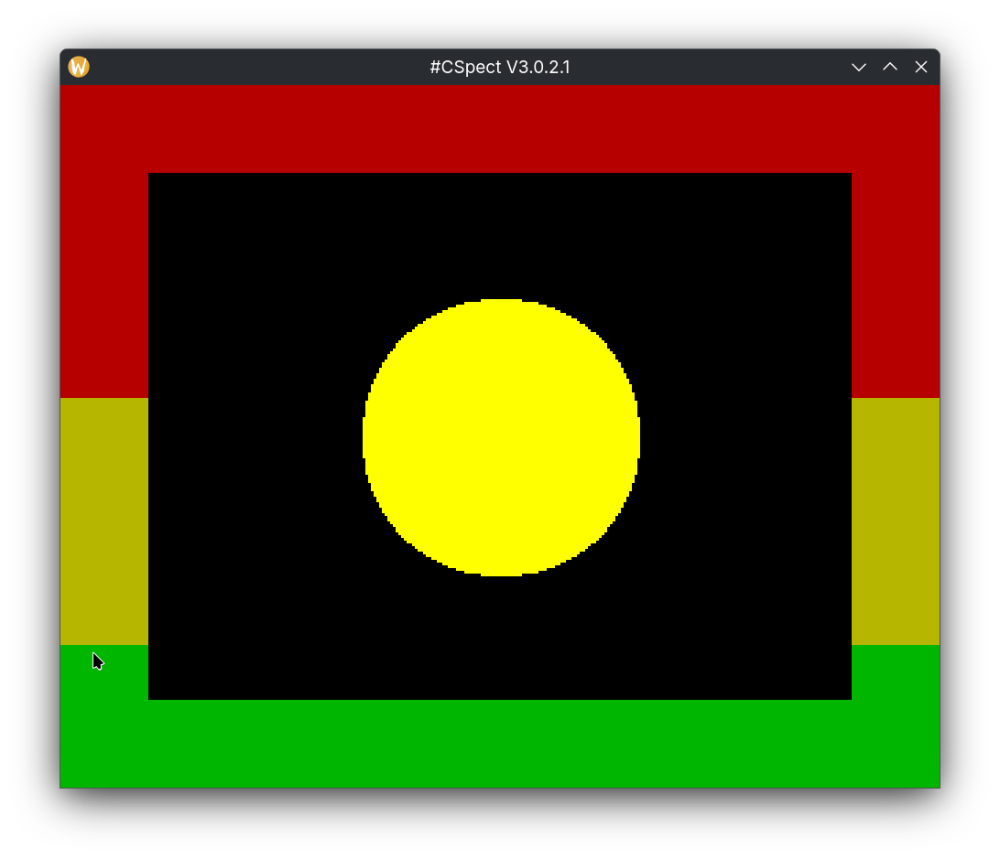

# Enjoying Messing With Z80

## Annoying Result

Now my filled circle function, using table of line widths, is annoying slower than the original!

Now to be fair my code is not optimised at all, in fact each component of my function is coded to be completely seperate from the other components, i.e. no shared register values, but I was expecting it to be closer at least.

I think my code is about 25% slower...

### Original filled circle

### My filled circle

## FYI

Border is set to red, then wait for clear screen, border set to yellow as I render the circle, then to green as we wait for vblank anmd swap the buffers. Also my filled circle is not rendering the last line and the sides are one picxel too small - gives me something to look into.

# Next3D - a 3D engine for the ZX Spectrum Next

## v0.5 BETA (Not production ready)

The Next-3D implementation is meant to be used in C via z88dk, but since we are aiming for high performance, all its core functionalities (rendering, projects, etc) are implemented in Z80 assembler, fully documented and built to take advantage of the Next hardware as much as possible.

This means the core library is easily portable to any environment, and its parts (such as plot or triangle) can easily be used in any C, Boriel Basic or other languages inline.

For sake of simplicity, the engine requires Layer 2 set to a resolution of 256x192.

## Why am I doing this?

Henrique Olifiers reached out to me the beginning of August 2025 - he had started coding this as part of the KS3 offering, and had discovered a couple of rendering bugs in the filled triangle routine I'd written for BBC BASIC for Next. I was aware of one of them, and got back to him to say that I'd be happy for either of us to work on a solution, and I'd roll it back into BBC BASIC for Next.

Long story short, he asked me that, given my experience, would I like to take this on as a project.

## Who is this for?

The code is targetting:

- Folk who want to understand how to write a 3D engine from scratch
- Folk who want a springboard to develop their own 3D games on the Next

As ever, the code is designed for readability, with each block of the assembler code commented.

## Etiquette

This software is a public BETA. Please do not submit any pull requests or issues at this point in time; they will be ignored.

## Demos

Distilled examples of using the 3D engine along with precompiled nex files can be found in the [demos subfolder](demos)

## Building

Requires the latest version of z88dk. [Installation instructions can be found here](https://github.com/z88dk/z88dk/wiki/installation).

There is a makefile:

- `make` to make the .nex file
- `make deploy` to make and deploy to the folder `Dev/next/dev` in your home folder
- `make clean` to clean the build directory

In addition, for Linux/Mac users, there is a bash script for building the 3D library code and all the demos

- `sh make_all.sh` to make all object files in root and the sub-folders in the demo folder
- `sh make_all.sh deploy` to make and deploy all nex files to the folder `Dev/next/dev` in your home folder
- `sh make_all.sh clean` to clean all the object files

## Running in emulator

This has been tested with CSpect and ZEsarUX. Please consult the documentation for the emulators on installation, configuration and usage.

## Running on a Spectrum Next

This code is compatible with all versions of the Spectrum Next running the latest firmware (24.11 or later).

Copy the .nex file(s) to a folder on the Spectrum Next and run from the browser.

To save removing the SD card every time, use [NextSync](https://solhsa.com/specnext.html#NEXTSYNC) to synchronise the folder `/Dev/next/dev` in your home folder with the Next over WiFi.

- Set up NextSync to synchronise the folder on your PC with the Spectrum Next
- Use `make deploy` or `sh make_all.sh deploy` to make the .nex file(s) and copy them to the sync folder `Dev/next/dev`
- Use the dot command .sync on the Spectrum Next to synchronise that folder with the Next

## Creating Models

Models can be imported from Blender via an intermediate step:

- Export from Blender as an Wavefront (.obj) file
- Convert to a C file using the script convert_model.py in the [python](./python/) directory

Models can contain colour information and must be scaled to fit within the 8-bit model space.

There are example models and converted files in the [models](./models/) directory:

- *.blend: The models in Blender format
- *.obj: The models exported from Blender in Wavefront (.obj) format
- *.h: The models as converted by convert_model.py

## Core Modules

Headline documentation is [available here](documentation/README.md).
